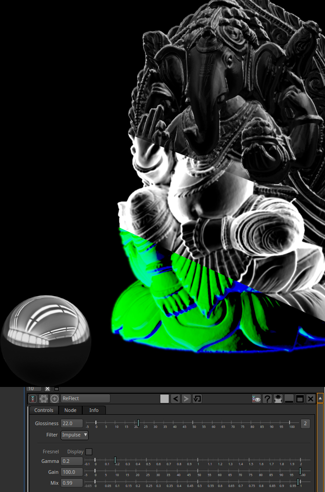

# ReFlect

this plugin take a Normal Pass and a reflection image as 
an input and generate fake reflections, like when using a matcap in 3D render.

You can then set the roughness / glossiness and Fresnel value.

This can be used with the Reshade plugin to add reflections to a relighted object.

Few tips : 
- You don't need big images for the reflection map. 
Generally 512*512 is way enough and will render faster.

- The impulse filter is the fastest and will work in many cases.

- you may have to set very low Gamma (~0.18) and very High Gain (70)  for the fresnel to look good.\

- The reflection image can be any image , 
try with different images to see what effect they provide. 
You can search for ZBrush matcaps to get nice images to play with.

Another example using a noise as a reflection map

