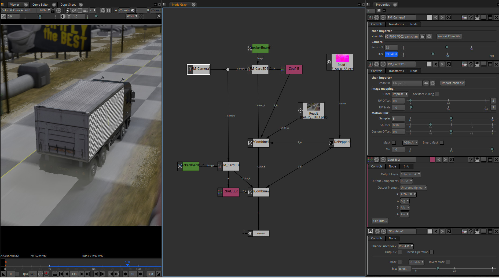

# Poor's Man 3D Card

## Create a 3D plane using PM_Camera informations

All of this is a workaround until Natron get's a proper 3D viewport. But from now this can become handy.

### Image mapping
You have to plug a PM_Camera and an image into the Card_3D node.
This image will be mapped into the plane.
Internally it use an STMap node to do the texturing.

Filter : The filtering algorithm, by default it's set to impulse that is the fastest but is aliased. Use another one if you have jagged edges.

Backface culling : if checked one side of the plane will be rendered transparent. 

UV Offset and Scale : manipulates the texture coordinates.

### Motion blur
Set the Samples value higher than 1 to create motion blur.
It's done by calculating subframe and merging them together.
So a value of 10 multiply rendering time by 10.

### Z buffer
The plugin generate anothers channels alongs with the RGBA. You can use a Suffle node and look for the Zbuf plane to access them.
The most intersting one is the Zbuf.B channel that contains the Zbuffer. This allows to "put" the plane in a 3D scene with proper occlusions using a ZCombine node.
The other channels are :

Zbuf.RG : the UV coordinates used to map the texture

Zbuf.A  : the alpha channel of the plane

Note that the Zbuffer is not interpolated by the motion blur for obvious reasons, as Zbuffer suffer from anti-aliasing or motion blur.

### .chan import
.chan is the Nuke human readable format to import/export camera and objects animation between software.
This Plugin as been tested and developped using Blender's .chan exporter, and not tested yet with other applications.
Blender .chan exporter is shipped with blender but not activated by default.

At that time, only the XYZ rotation order is supported (this is blender .chan exporter default)

Also , the importer world coordinates is set to Y up. If you use blender , you can just export the position/rotation of any object as a .chan file leaving the parameters by default and you should be good.

### Extra Transforms
In the Transforms tab you have two sets of XYZ location and rotation. One is used by the .chan importer and is likely to be animated , the other one allow you to offset position and rotation of the plane.

If you don't use a .chan file you can use watever set you want, or both.

In the same fashion, you can set the plane size using two parameters.
Scale X/Y : allow you to set the X/Y ratio of the image ex :

if your input image is at 2048x1024 , you can set the X/Y values to 2.048x1.024 , or 204.8x102.4 whatever...

Then with the uniform scale you can scale both X and Y to get the plane a proper size according to your scene.
## Technical infos :

This Plugin get the camera coordinates(matrix) from PM_Camera node using colors. So if you connect the Camera node to a viewer you should see the colors that contains camera informations.

The plane is calculated using a raytracer inside a ShaderToy node.
Obviously it would have been better to come up with a more optimised solution but that was already a challenge for me :)

## some screenshots
A simple setup with a camera and a card :

A more advanced setup , two card are added to the image using some Zcombine nodes. Of course you can also use a regular merge node if you don't want to use the Zpass.
In this example the image as grain in the Z because of blender/cycles output with motion blur. But otherwise it should work as expected.

plugin original implementation by Sozap, with many help from this site : https://www.scratchapixel.com/
